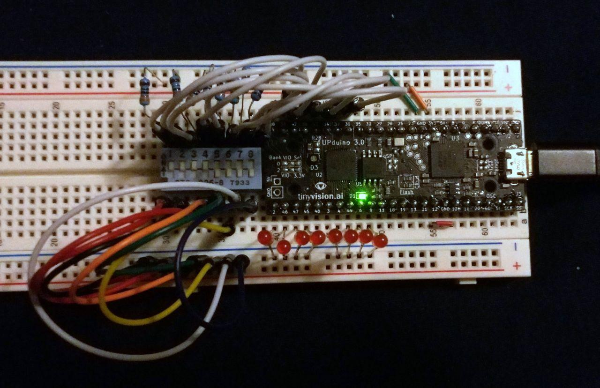

## hamming

A simple hamming(7,4) implementation

- hamming_set - takes in 4 bits of data and gives a proper hamming code
- hamming_detect - takes in a hamming code and gives back either the error location (if there's one error) or if there was a double error (in which it will set error location to zero)
- hamming_correct - takes in a hamming code and error location and corrects it, giving back the original 4 bits of data

Thank you to 3blue1brown and Ben Eater's videos on this topic, as they were the resources I used to implement this project:
- 3blue1brown: https://www.youtube.com/watch?v=X8jsijhllIA, https://www.youtube.com/watch?v=b3NxrZOu_CE
- Ben Eater: https://www.youtube.com/watch?v=h0jloehRKas

hamming_set was tested on this board by running through each combination of 4 bits and checking the output. While initially testing, I found that I had accidentally swapped P2 and D1, thus I was getting incorrect outputs.

hamming_detect was tested on this board by starting with a known good hamming code and changing one bit at a time to verify a correct output.

hamming_correct was tested on this board by hard setting a hamming code and error location and then looking at the data output to make sure it was correct.
