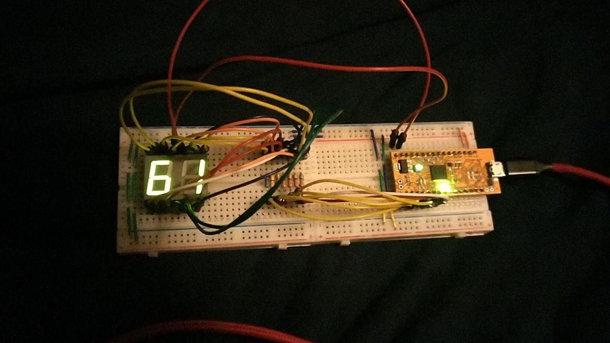

## uart_echo

This was a translation of Verilog code from [osresearch/up5k](https://github.com/osresearch/up5k) into VHDL for the Upduino v2. This program takes any information received on the tx/rx pins and sends it back, aka an echo. The on board LED flashes blue when receiving and red when sending. There is a steady flashing green light to show activity.

Compile and flash your FPGA using `make`, then in order to communicate with the FPGA, you'll need to restart it. From there, open up your favorite COM program (I use picocom for this), and run `picocom /dev/ttyUSB0 -b 3000000`. The COM port may be different for your computer. The baud rate is 3M.

Requires a working Icestorm toolchain setup (http://www.clifford.at/icestorm/),
GHDL (https://github.com/ghdl/ghdl), and ghdl-yosys-plugin
(https://github.com/ghdl/ghdl-yosys-plugin).

Files:
 - top.pcf: indicates which variables from your "top" file connect to which
 pins on the FPGA
 - top.vhdl
 - Makefile: compile and flash, see `make help` for usage info
 - uart.vhdl: UART tools and utilities.

top:

fifo_spram:

uart_rx:

uart_tx:

